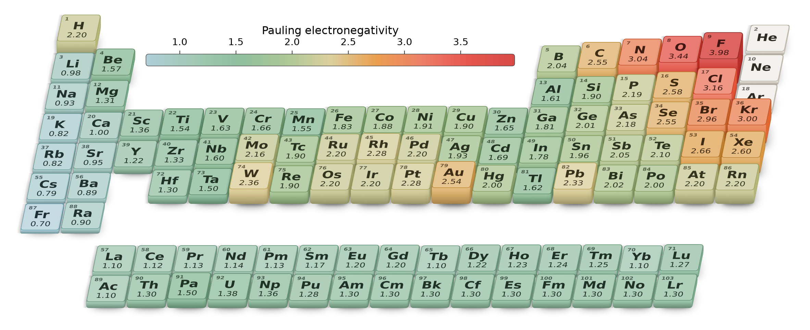
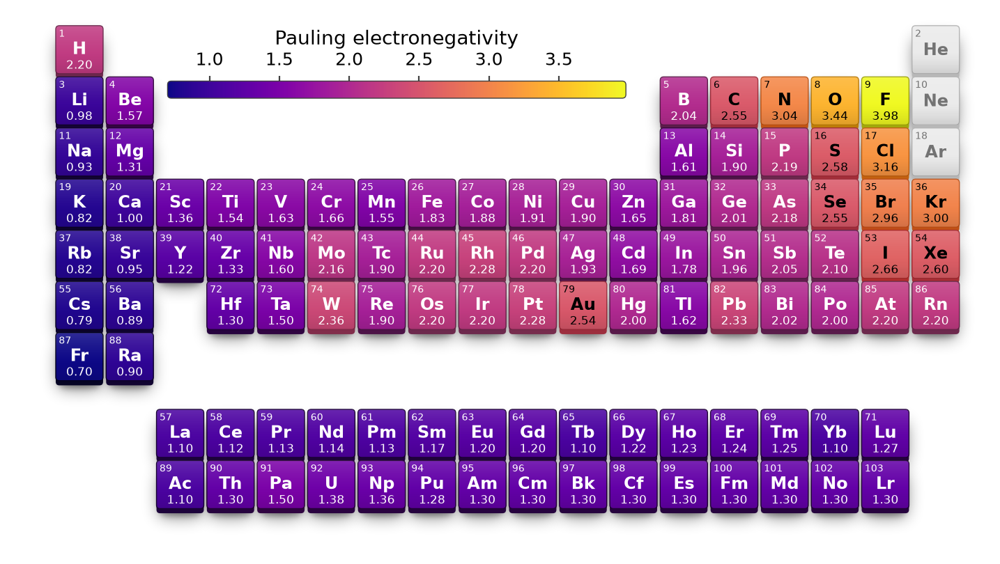
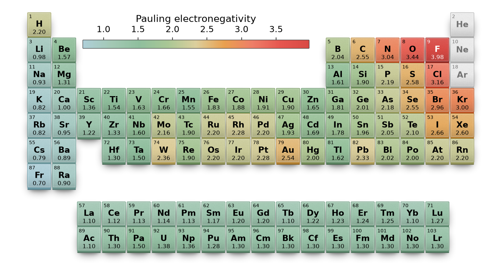
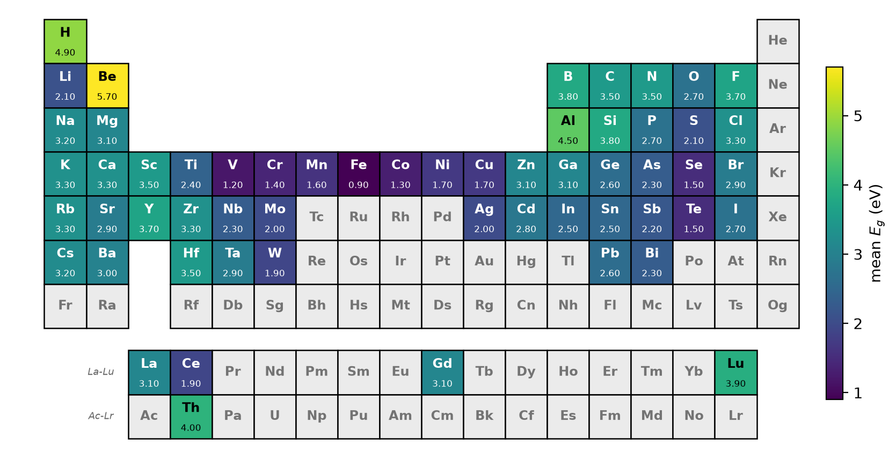
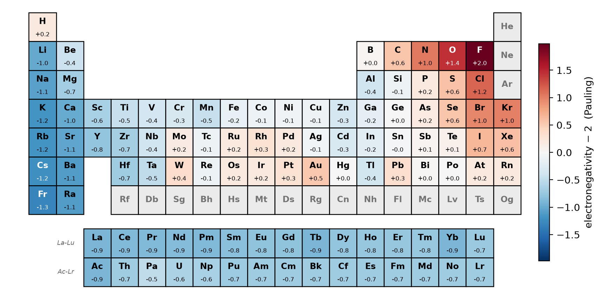
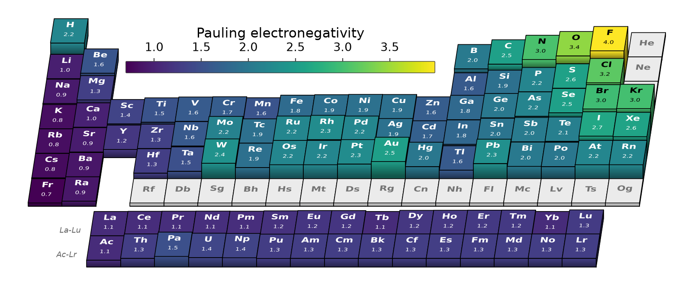

# periodicplots

Periodic table vector heatmaps in matplotlib. Colour each element by any property, in
2D or in 3D relief, and compose the result into multi-panel figures via `ax=`.
Depends only on `matplotlib` and `numpy`; element data is bundled.

`periodic_table_3d(values)` — the value sets colour *and* block height:



`periodic_table(values, tile_style="3d")` — 2D table, round glossy tiles
(`cmap="plasma"`):



`periodic_table(values, tile_style="3d", tile_shape="square")` — matte, grainy,
chamfered (`cmap="poster"`):



## Install

```bash
pip install periodicplots
# or, from a clone:
pip install -e .
```

## Quick start

```python
import periodicplots as pp

pp.periodic_table({"Fe": 0.9, "O": 2.7, "Si": 3.8, "Cu": 1.7, "H": 4.9},
                  label_cbar="mean $E_g$ (eV)", savepath="gap.pdf")

pp.periodic_table([26, 8], [0.9, 2.7])       # or two parallel sequences
```

Each cell shows the element symbol and its value; elements without a value are
drawn in `missing_color` (NaN counts as no value).



```python
pp.periodic_table(slopes, cmap="RdBu_r", cmap_norm="diverging",
                  label_cbar="d$E_g$/dT (meV/K)")
```



| argument | default | meaning |
|---|---|---|
| `cmap` | `"viridis"` | colormap name or instance |
| `cmap_norm` | `None` | value → colour mapping: `None` (min–max), `"diverging"`, `(vmin, vmax)` or a `Normalize` |
| `label_cbar` | `None` | colourbar label |
| `value_fmt` | `"{:.2f}"` | format of the in-cell value |
| `show_value` | `True` | print the value in each cell |
| `show_at_number` / `show_at_mass` / `show_name` | `False` | atomic number / atomic mass / element name |
| `show_group_period` | `False` | label groups (1–18) and periods (1–7) |
| `draw_missing` | `True` | draw elements without a value |
| `max_z` | `118` | highest atomic number drawn (`103` omits the superheavies) |
| `tile_style` / `tile_shape` | `"flat"` / `"round"` | how a cell is drawn (below) |
| `ax` | `None` | draw into an existing axes (`figsize` is then ignored) |
| `colorbar` | `True` | attach a colourbar |
| `cbar_loc` | `"gap"` | `"gap"` (in the empty Be–B block), `"right"`, `"left"`, `"top"`, `"bottom"` |
| `cbar_shape` | `None` | colourbar frame corners, `"round"` or `"square"`; follows `tile_shape` unless set |
| `cbar_kw` | `None` | passed to `fig.colorbar` (`ticks`, `format`, … anywhere; `fraction`/`pad`/`shrink` for the outside locations) |
| `savepath` | `None` | save the figure; the extension picks the format |

## 3D tables

`periodic_table_3d` maps the value onto each element's height as well as its
colour: blocks rise out of the tipped-back table, taller ones partly occluding
the row behind. With no data at all, tiles take chemical-family colours and
stay flat.

```python
pp.periodic_table_3d(values, show_value=True)
pp.periodic_table_3d(values, cmap_norm="diverging", relief_signed=True)
```

| argument | default | meaning |
|---|---|---|
| `relief_height` | `0.60` | height of the tallest block, in cell heights |
| `relief_signed` | `False` | measure the relief from zero, so negative values sink into a pit |
| `relief_norm` | `None` | drive the heights from their own normalisation instead of `cmap_norm` |
| `tilt` / `side_tilt` | `0.20` / `0.15` | how far the table tips back, and yaws sideways (`tile_style="3d"` only) |
| `background` | `False` | `"gradient"` for a pastel backdrop, or any matplotlib colour (`"3d"` only) |
| `elements` | `None` | restrict which elements are drawn (`"3d"` only) |

With the default `tile_style="3d"` the cmap defaults to `"poster"`, a pastel
ramp registered with matplotlib — `cmap="poster"` (or `"poster_r"`) works in
`periodic_table` and any other plot. `tile_style="flat"` keeps `"viridis"` and
the flat table's text defaults (value shown, number/mass hidden).

## Tile styles

Both functions take `tile_style` (`"flat"` or `"3d"`) and `tile_shape`
(`"round"` or `"square"`): how a cell is *drawn*, independent of whether its
value sets a height.

```python
pp.periodic_table(values, tile_style="3d")         # 2D table, 3D-look tiles
pp.periodic_table(values, tile_shape="square")     # flat cells, sharp corners
pp.periodic_table_3d(values, tile_shape="square")  # relief, matte square tiles
pp.periodic_table_3d(values, tile_style="flat")    # relief, flat-shaded blocks
```

The two `"3d"` finishes are shown at the top: `tile_shape="round"` is glossy
with rounded corners, `"square"` is matte and grainy with chamfered edges.

`"3d"` tiles take their shadows and gloss from small rasters, which PDF and SVG
embed alongside the vector outlines and text. `edge_color`/`edge_width` do not
apply to them — their outline comes from the face colour.

`tile_style="flat"` draws flat-colour extruded blocks in an oblique projection
with the labels laid in the plane of the table, so the table itself is pure
vector (only the colourbar gradient is a raster, as in any matplotlib figure). It adds `depth` (row pitch, `0.72`), `shear` (lateral slant,
`-0.11`), `base_height` (`0.10`), `gap`, `wall_shade`/`side_shade`,
`wall_fade`/`fade_color`, `pit_color`, `text_on_surface`, and `periodic_table`'s
`edge_color`/`edge_width`/`text_color` and per-role `*_fontsize` options.
`tile_shape` does not apply — these blocks are sharp-cornered. Its
`relief_height` defaults to `1.0` rather than `0.60`: the shallower view needs
a taller block to read as the same relief.

`periodic_table_3d(..., tile_style="flat")`:



## Compose into a figure

```python
import matplotlib.pyplot as plt

fig, (axa, axb) = plt.subplots(1, 2, figsize=(15, 4))
pp.periodic_table(gap,   ax=axa, label_cbar="$E_g$ (eV)")
pp.periodic_table(slope, ax=axb, cmap="RdBu_r", cmap_norm="diverging")
```

Every function returns a `PeriodicTablePlot` with `.fig`, `.ax` and
`.mappable` — use the mappable to place your own colourbar. (`.mappable` is
`None` only for the no-data family-coloured poster, which has no value scale.)

## Saving

`savepath` works on every function and takes any format matplotlib supports;
the extension picks it. Extra keywords are passed on to `savefig`:

```python
pp.periodic_table(values, savepath="table.pdf")            # or .svg, .png, ...
pp.periodic_table(values, savepath="table.png", dpi=300, transparent=True)
```

Or save afterwards, from the returned object or its `.fig`:

```python
r = pp.periodic_table(values)
r.save("table.svg")
```

## Examples

[`examples/`](examples/): `example_basic.py`, `example_options.py`,
`example_compose.py`, `example_3d.py`, `example_relief.py`.

## License

MIT
